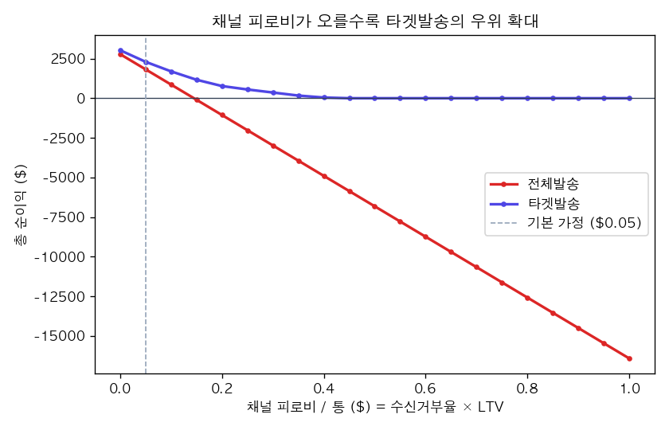
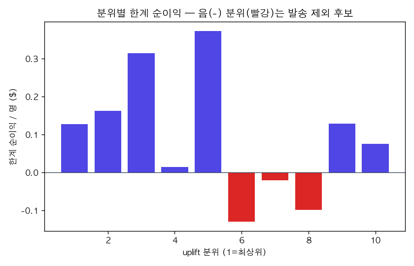

# CRM 푸시, 다 보낼까 거를까 — uplift(증분)로 답하는 타겟팅

**"그냥 다 보내면 되지, 왜 굳이 ML로 거르냐"는 팀장을 설득하는 분석. 평균 효과가 아니라 *증분(incrementality)*으로, 그리고 데이터를 조작해 ML을 정당화하지 않고 정직하게.**

<sub>CRM·그로스 데이터 분석 · Python · uplift modeling(scikit-uplift) · 인과추론 · 증분 의사결정</sub>

> **가상 사전과제**: "K은행 그로스팀이 CRM 캠페인을 운영한다. 매번 전체 고객에게 푸시를 쏜다.
> '전체발송 vs ML로 거른 타겟발송', 무엇이 옳은가? 데이터로 답하라."
>
> 이 프로젝트는 그 질문을 **실제 무작위배정 이메일 캠페인 데이터**(Hillstrom, 6.4만 명)로 정량화한다.
> 합성 데이터로 인과를 *심지* 않는다 — control(무발송)군이 깨끗한 반사실을 주는 실데이터를 쓴다.

이 프로젝트는 [`amazon-seller-entry-analysis`](../amazon-seller-entry-analysis)(공급측·셀러 진입 의사결정)의 **수요측 짝**이다. 메시지: *마켓플레이스의 양면을 보고, 인과/실험까지 다룬다.*

## 이 프로젝트로 무엇을 보여주는가

화려한 모델이 아니라 **"증분으로 사고하고, 가정을 드러내고, 결론을 조작하지 않는"** 분석 태도.

| 역량 | 이 프로젝트에서 |
|---|---|
| **증분 사고** | 오픈율·전환율(평균)이 아니라 treated−control(증분)으로 의사결정. 무작위배정을 반사실로 활용 |
| **지적 정직성** | "이메일은 평균적으로 먹힌다 → 다 보내도 틀리지 않다"를 먼저 인정. ML이 필요한 척 데이터를 심지 않음 |
| **가정의 투명성** | 데이터에 없는 마진·LTV·수신거부는 `config`의 명시적 가정으로 분리하고 민감도로 다룸 |
| **노이즈에 대한 겸손** | 분위별 증분의 표준오차를 직접 계산해 과대주장(=확정 sleeping-dog)을 거부 |

## 핵심 결과 3개

1. **이메일은 평균적으로 강하게 먹힌다** — 발송군의 증분: visit **+57%**, conversion **+86%**, spend **+$0.60/명(+91%)**. → *"다 보내"가 그 자체로 틀린 건 아니다.* (결론을 조작하지 않는다는 출발점)
2. **그러나 가치는 "발송당 이익"과 "음의 꼬리"에 있다** — uplift 모델(Qini AUC 0.030, Hillstrom 기준 정상)이 고객을 증분 가치로 정렬. 음(-)의 증분 분위를 제외하면 기본 가정에서 순이익 **+$477(+26%)**.
3. **진짜 답은 채널 피로비에 달려 있다** — 수신거부 1건의 비용이 **~$0.15/통**을 넘으면 *전체발송은 순손실*로 돌아선다. 이메일(싸다)은 안전권, 푸시·SMS(피로비 큼)면 타겟팅이 정답.




> **팀장 설득 한 줄**: *"다 보내라"가 옳은 건 채널이 이메일처럼 싸고 발송 예산이 무한할 때뿐입니다. 푸시·SMS이거나 발송 capacity가 유한하면, uplift 정렬이 발송당 이익을 올리고 음의 증분 꼬리를 잘라냅니다 — 그 손익분기를 이 표가 수치로 보여줍니다.*

## 분석 질문 (R2 → Gap → 분해)

- **R2(원하는 상태)**: 동일 발송예산에서 *순증분이익* 최대화 + 채널 수명(수신거부) 방어.
- **핵심방정식**: 순이익/명 = 증분구매 × AOV × 마진율 − 발송비 − 수신거부율 × LTV.
- **분해**: 퍼널(발송→visit→conversion→spend) × uplift 분위 세그먼트 × 채널피로비 민감도.

## 데이터

| 소스 | 규모 | 용도 |
|---|---|---|
| [Hillstrom MineThatData Email Challenge](https://blog.minethatdata.com/2008/03/minethatdata-e-mail-analytics-and-data.html) (via `scikit-uplift`) | 64,000 고객, 3군 무작위배정(Mens/Womens/No-Email) | 메인 |

- **결과 변수**: `visit`/`conversion`/`spend` (발송 후 2주). **treatment**: 이메일 발송(Mens+Womens)=1, 무발송=0.
- **데이터에 없는 것(=가정)**: 마진율·발송비·수신거부율·LTV → `config/config.yaml`에 명시, `docs/limitations.md`에 노출.

## 실행

```bash
make setup          # 전용 venv + 의존성 (numpy<2 핀이 scikit-uplift 호환의 핵심)
make all            # eda → model → incrementality → figures (재현 가능)

# 단계별:
make eda            # 전체 ATE + H1 세그먼트 탐색 → docs/eda_findings.md
make model          # uplift 모델 + Qini/AUUC → data/test_with_uplift.parquet
make incrementality # 전체발송 vs 타겟발송 증분 이익 → docs/incrementality_report.md
make figures        # 의사결정 차트 → docs/figures/
```

## 구조

```
config/config.yaml        # treatment 이진화·가정 파라미터(마진·LTV·발송비·수신거부)
src/data.py               # Hillstrom 로드·이진화·검증(무작위배정·퍼널 단조성)
src/eda.py                # Step2: 전체 ATE + H1(sleeping-dog) 세그먼트 탐색
src/uplift.py             # Step3a: T-learner(TwoModels) + Qini/AUUC
src/incrementality.py     # Step3b: 분위 한계분석 + 채널피로비 민감도
src/figures.py            # Qini·분위 순이익·민감도 차트
docs/                     # eda_findings · incrementality_report · decisions · limitations · figures/
report/final_report.md    # 의사결정 메모(팀장 설득)
```

## 정직한 한계 (요약 — 상세는 [docs/limitations.md](docs/limitations.md))

- **수신거부·LTV가 데이터에 없다** → 채널피로비는 가정. 그래서 *단일 답이 아니라 민감도*로 제시.
- **uplift 신호가 약하다**(Qini 0.030) → 분위별 증분은 노이즈(표준오차 ≈ ±0.004). "특정 분위 = 확정 sleeping-dog"은 과대주장이며, 실서비스에선 홀드아웃 재검증 필요.
- **2008년 단일 캠페인** → 시점·업종 일반화 제한. 방법론 데모로 해석.
